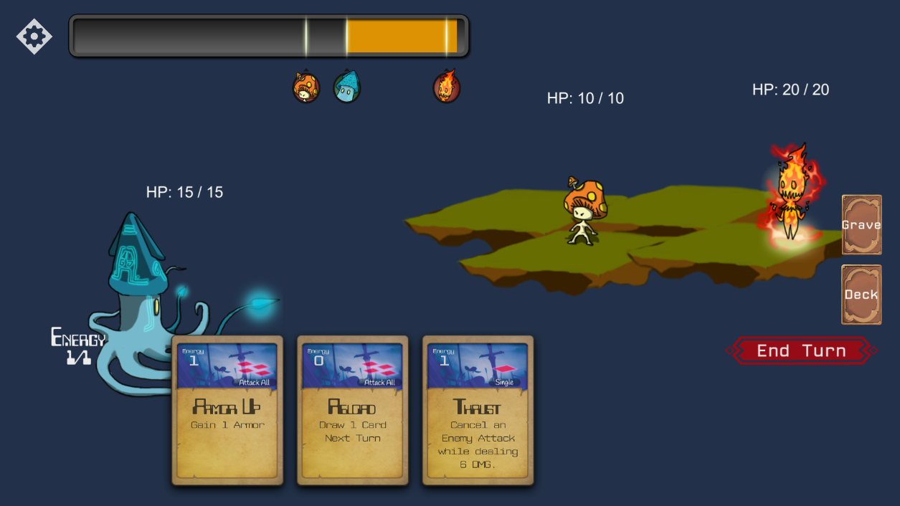
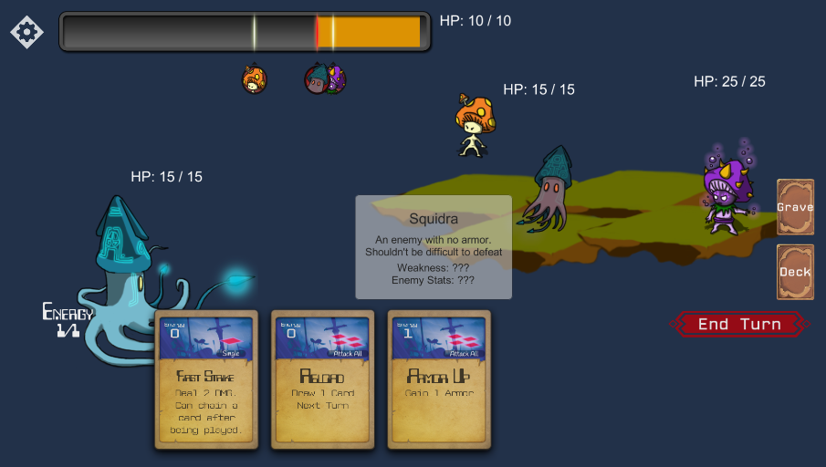

## Neomon
This is a Unity project from my original project based off of objective C using cocos2d on the mac osx. Originally titled Fakemon which focused on copying the battle scene, the purpose of this project was to port the game over to unity while adding more modern features. Most of the original images I drew years ago were reused while introducing new features such as: cards, decks, real-time turn based system, status effects win lose condition and menu.

